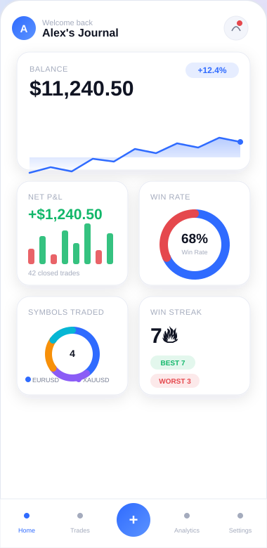
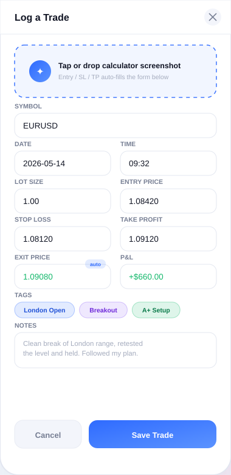
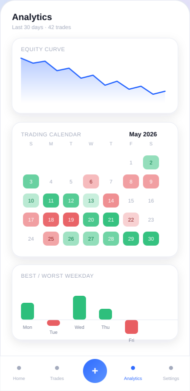

<div align="center">


<br/>


</div>

## ✨ What is this?

**Trading Journal** is a single-file, offline-first web app for traders who want to log trades, see their edge, and stop guessing. Everything — the UI, the charting engine, the analytics, the storage layer — lives in **one `index.html` file**. No build step, no npm install, no backend required. Open it in a browser and it just works.

It's built for people who trade forex, crypto, indices, or stocks and want a *fast*, *private*, and genuinely nice-looking place to track performance.

<table>
<tr>
<td width="33%" align="center">🔒<br/><b>100% local</b><br/><sub>Data stored in IndexedDB on your device</sub></td>
<td width="33%" align="center">⚡<br/><b>Zero dependencies</b><br/><sub>No React, no Chart.js — hand-rolled canvas charts</sub></td>
<td width="33%" align="center">📱<br/><b>Mobile-first</b><br/><sub>Scales beautifully from phone to desktop</sub></td>
</tr>
</table>

---

## 📸 A look inside

> These previews are stylized mockups rebuilt from the app's own colour palette and layout — a live screenshot tool wasn't available in this environment, so what you're seeing below is a faithful recreation, not a rendered capture. Swap in real screenshots any time by dropping PNGs into `assets/` and repointing the links below.

<div align="center">
<table>
<tr>
<td align="center" width="33%">
<br/>
<b>Customizable Dashboard</b><br/>
<sub>Drag-and-drop widgets, live balance curve, win-rate ring</sub>
</td>
<td align="center" width="33%">
<br/>
<b>Smart Trade Logger</b><br/>
<sub>Screenshot upload auto-fills entry / SL / TP / P&L</sub>
</td>
<td align="center" width="33%">
<br/>
<b>Deep Analytics</b><br/>
<sub>Equity curve, calendar heatmap, weekday breakdown</sub>
</td>
</tr>
</table>
</div>

---

## 🚀 Features

### 📊 A dashboard you actually build yourself
A widget catalogue lets you assemble your own dashboard from 20+ modules, grouped into categories:

| Category | Widgets |
|---|---|
| 🟦 **Performance** | Balance, Net P&L, Win Rate, Trade Count, Profit Factor, Expectancy, Win/Loss Streaks |
| 🟥 **Risk** | Max Drawdown, Avg Win / Avg Loss, Average Day Win/Loss, Avg Risk/Reward |
| 🟩 **Timing** | Net Daily P&L, Monthly Profit, Session Performance, Trading Sessions clock, Trading Calendar, Best/Worst Weekday, Best/Worst Hour |
| 🟪 **Symbols** | Symbols Traded breakdown |
| 🟨 **AI & Summary** | Performance Summary (auto-generated risk & stats digest) |

Every widget is searchable by the *question it answers* — e.g. typing "Am I winning more than I lose?" surfaces the Win Rate widget.

### ✍️ Fast, intelligent trade logging
- Drop in a **calculator screenshot** and the form auto-fills Entry, SL, TP, and even P&L.
- Auto-calculates **P&L** and **Exit Price** from your Entry, Exit, and Lot Size the moment you have enough data — with an `auto` badge so you always know what's computed vs. manually entered.
- Tag trades (`London Open`, `Breakout`, `A+ Setup`...) and attach freeform notes.
- Mark stop-loss / take-profit / exit as **N/A** for trades that don't use them.

### 📈 Hand-built charting engine
No Chart.js, no D3 — every line chart, doughnut, gauge, and signed bar chart is drawn straight onto `<canvas>` with custom rendering code, kept lightweight and dependency-free.

### 🗓️ Calendar & session awareness
A colour-graded monthly calendar shows which days were profitable at a glance, plus a live clock for major trading session opens/closes.

### 💾 Your data, your device
- Stored locally via **IndexedDB** — nothing is sent to a server unless you explicitly configure a backend URL for screenshot OCR.
- One-tap **Export** / **Import** as JSON for backups or migrating devices.
- A storage-usage meter keeps you informed of how much space your journal is using.

### 🎨 Genuinely nice to look at
Animated gradient backgrounds, smooth widget transitions, a full onboarding flow, and a responsive shell that adapts from a 380px phone up to a centered desktop card layout.

---

## 🛠️ Tech stack

<div align="center">


</div>

- **No frameworks** — vanilla JS with a small internal render/state loop
- **No build tools** — it's one `.html` file, deploy it anywhere static files are served
- **Google Fonts**: Space Grotesk (display) + Inter (body)
- **Storage**: IndexedDB for trades/settings, with JSON export/import
- **Optional backend**: bring your own OCR endpoint for screenshot auto-fill (configurable URL in Settings)

---

## 🏁 Getting started

No install, no dependencies, no server needed.

```bash
# Clone or download the repo
git clone https://github.com/your-username/trading-journal.git
cd trading-journal

# Just open it
open index.html      # macOS
start index.html      # Windows
xdg-open index.html   # Linux
```

Or serve it locally if you prefer:

```bash
python3 -m http.server 8080
# then visit http://localhost:8080
```

On first launch you'll be walked through a short onboarding flow — set your name and starting balance, and you're logging trades in under a minute.

---

## 📂 Project structure

```
trading-journal/
├── index.html          # The entire app — markup, styles, and logic
└── assets/             # README preview images
    ├── dashboard-mockup.svg
    ├── log-trade-mockup.svg
    └── analytics-mockup.svg
```

---

## 🔐 Data & privacy

All trade data lives in **IndexedDB in your browser** — it never leaves your device unless you:
1. Manually **export** it as JSON, or
2. Configure a custom **backend URL** for the optional screenshot-OCR auto-fill feature.

There's no analytics, no telemetry, no accounts.

---

## 🗺️ Roadmap ideas

- [ ] Dark mode theme
- [ ] Multi-account / multi-strategy journals
- [ ] CSV broker statement import
- [ ] Cloud sync (optional, opt-in)
- [ ] Shareable read-only performance reports

---

## 🤝 Contributing

Issues and pull requests are welcome. Since everything lives in a single file, keep diffs focused and test across mobile and desktop breakpoints before submitting.

## 📄 License

MIT — do whatever you'd like with it.

<div align="center">


**Made for traders who'd rather see the data than guess.**

</div>
